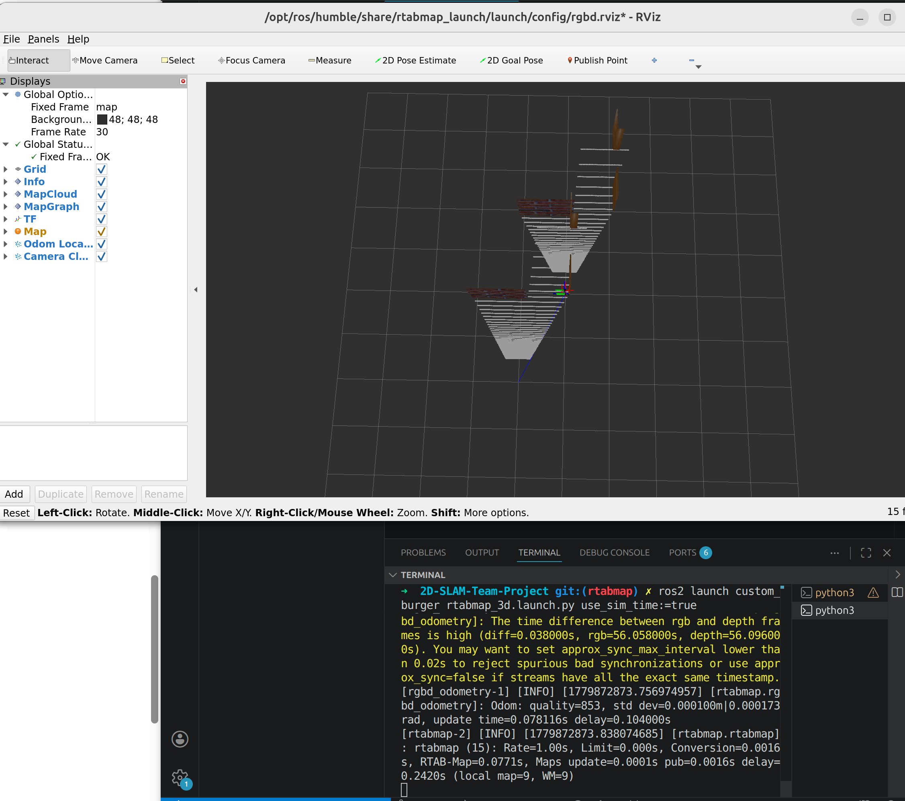

# 상황
- `ros2 launch custom_burger my_house.launch.py` 명령어를 입력했을 때 에러가 발생한다.

```zsh
[INFO] [launch]: All log files can be found below /root/.ros/log/2026-05-26-07-54-56-771350-MSKIm-57938

[INFO] [launch]: Default logging verbosity is set to INFO

[ERROR] [launch]: Caught exception in launch (see debug for traceback): Caught multiple exceptions when trying to load file of format [py]:

 - PackageNotFoundError: "package 'turtlebot3_gazebo' not found, searching: ['/workspace/2D-SLAM-Team-Project/install/taeyoung_explorer', '/workspace/2D-SLAM-Team-Project/install/custom_burger', '/workspace/install/taeyoung_explorer', '/workspace/install/custom_burger', '/opt/ros/humble']"

 - InvalidFrontendLaunchFileError: The launch file may have a syntax error, or its format is unknown
```

# 원인 분석
- Dependency 누락으로 인한 Exception이 발생
- launch file 내부에서 `turtlebot3_gazebo` package를 include하거나 참조하고 있으나, Docker container의 Enviroment path(/opt/ros/humble)에 해당 package 존재하지 않음.
- `rosdep install` 과정에서 해당 Dependency가 잡히지 않음


# 해결
### 1. Manual Package Installation
- 현재 Conatiner Environment에 TurtleBot3 시뮬레이션 관련 Package들을 직접 다운로드
```zsh
# Update apt repository and install turtlebot3 simulation packages
apt-get update
apt-get install -y ros-humble-turtlebot3-gazebo ros-humble-turtlebot3-simulations ros-humble-turtlebot3-msgs
```

### 2. `package.xml` Dependency Configuration 업데이트
`/2D-SLAM-Team-Project/src/custom_burger`에서 `package.xml`에 다음 Dependency 명시적으로 선언

```XML
<exec_depend>turtlebot3_gazebo</exec_depend>
<exec_depend>turtlebot3_simulations</exec_depend>
```

### 3. Rebuild & Env. sourcing
```zsh
cd ~/2D-SLAM-Team-Project

colcon build
# 빌드 속도 최적화할때 필요한거만
# colcon build --symlink-install --pacakges-select custom_burger

# Build 후 Env. 갱신
source install/setup.zsh
```

## [Terminal 1] Gazebo 시뮬레이션 실행(환경 구성)
```zsh
export TURTLEBOT3_MODEL=burger

source install/setup.zsh

ros2 launch custom_burger my_house.launch.py
```

## [Terminal 2] RTAB-MAP 및 RViz2 실행
```zsh
export TURTLEBOT3_MODEL=burger

source install/setup.zsh

ros2 launch custom_burger rtabmap_3d.launch.py use_sim_time:=true
```

그런데 **Container와 Host OS 간의 X11 Display Server Authorization** 으로 인해 통신이 실패했다.

## [원인 1]

- `[rviz2-3] qt.qpa.xcb: could not connect to display :1`
- `Authorization required, but no authorization protocol specified`

=> GUI Application이 Host의 Window System에 Rendering을 요청했으나 Permission denial으로 인해 reject됨.
=> Host OS(Ubuntu 24.04 LTS)의 Display Server는 보안을 위해 외부(Docker container의 root user)로부터의 X11 Socket 접근을 Default로 Block하고 있기 때문에 발생하는 현상

## [원인 1의 해결]
- Host OS에서 Docker container가 Host의 display에 접근할 수 있도록 함

```zsh
# Local connection에 대해 Docker root user의 X11 접근 허용
xhost +local:root

echo $DISPLAY
# 정상적인 경우 :0 또는 :1 등 Host와 동일한 Output이 리턴되어야 합니다.
```

그리고 다시 다음 명령어를 입력하였습니다.


```zsh
cd ~/2D-SLAM-Team-Project

colcon build
# 빌드 속도 최적화할때 필요한거만
# colcon build --symlink-install --pacakges-select custom_burger

# Build 후 Env. 갱신
source install/setup.zsh
```

## [Terminal 1] Gazebo 시뮬레이션 실행(환경 구성)
```zsh
export TURTLEBOT3_MODEL=burger

source install/setup.zsh

ros2 launch custom_burger my_house.launch.py
```

## [Terminal 2] RTAB-MAP 및 RViz2 실행
```zsh
export TURTLEBOT3_MODEL=burger

source install/setup.zsh

ros2 launch custom_burger rtabmap_3d.launch.py use_sim_time:=true
```


# [결과]
